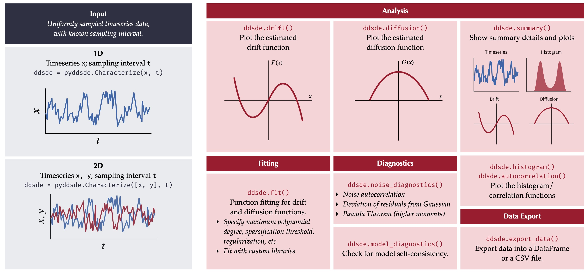

PyDaddy (Python Data-Driven Dynamics)
=====================================

PyDaddy is a comprehensive and easy to use python package to discover data-derived stochastic differential equations from time series data. PyDaddy takes the time series of state variable :math:`x`, scalar or 2-dimensional vector, as input and discovers an SDE of the form:

.. math::

    \frac{dx}{dt} = f(x) + g(x) \cdot \eta(t)

where $\eta(t)$ is uncorrelated white noise. The function :math:`f` is called the *drift*, and governs the deterministic part of the dynamics. :math:`g^2` is called the *diffusion* and governs the stochastic part of the dynamics.

.. figure:: resources/PyDaddyExample.jpg
    :width: 70%

    An example summary plot generated by PyDaddy, for a vector time series dataset.

PyDaddy also provides a range of functionality such as equation-learning for the drift and diffusion functions using sparse regresssion and a suite of diagnostic functions.

    Schematic illustration of PyDaddy functionality.

Get Started
-----------

* To take PyDaddy for a walk, see the :ref:`tutorial notebooks <tutorials>`. The notebooks can be executed online on Google Colab; no installation is necessary!
* To install PyDaddy on your system, see installation instructions.
* See the usage guide and advanced usage tips pages for detailed usage instructions.

Citation
--------

If you are using this package in your research, please cite the repository and the associated paper as follows:

Nabeel, A., Karichannavar, A., Palathingal, S., Jhawar, J., Danny Raj, M., & Guttal, V. (2022). PyDaddy: A Python Package for Discovering SDEs from Time Series Data (Version 0.1.5) [Computer software]. https://github.com/tee-lab/PyDaddy

Nabeel, A., Karichannavar, A., Palathingal, S., Jhawar, J., Danny Raj, M., & Guttal, V. (2022). PyDaddy: A Python package for discovering stochastic dynamical equations from timeseries data. arXiv preprint arXiv:2205.02645.

Contents
--------

.. toctree::
    :maxdepth: 1

    tutorials
    installation
    usage
    tips
    datasets
    api
    citation

