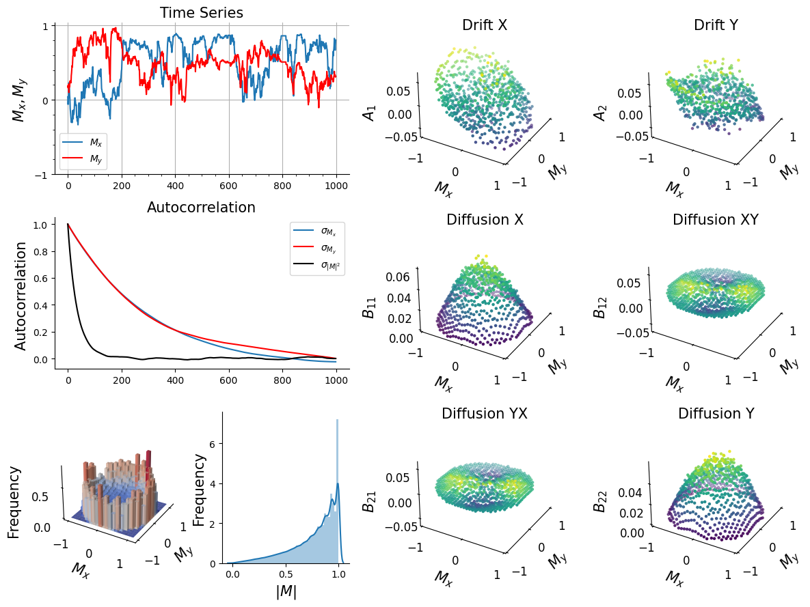
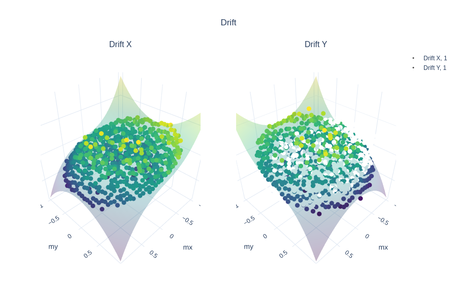
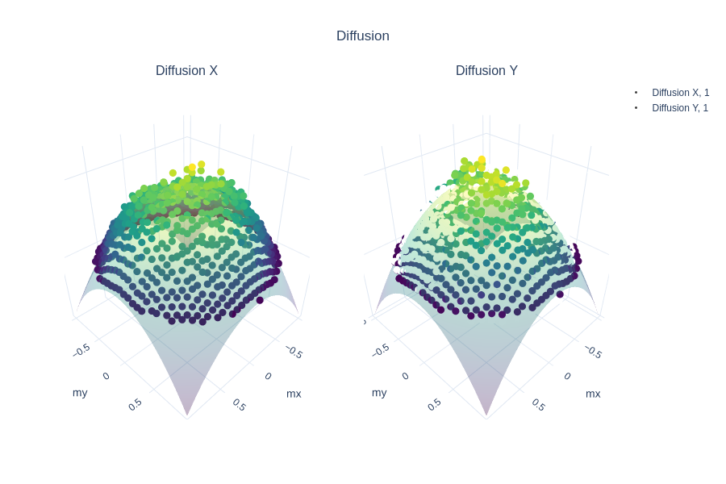
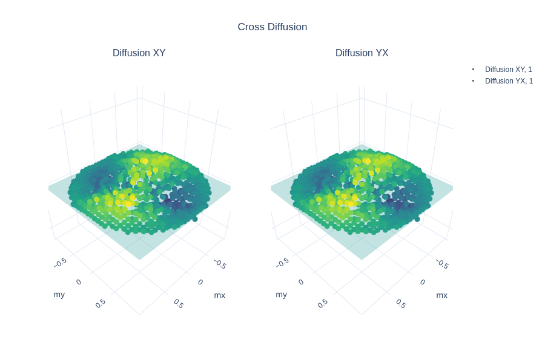
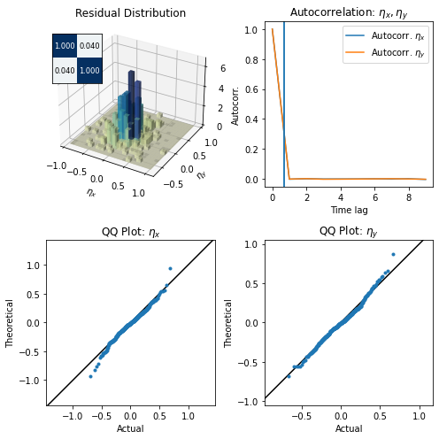

``pydaddy`` with vector data
============================

(This notebook assumes that you have gone through the `Getting
Started <./1%20-%20Getting%20Started.ipynb>`__ notebook.)

``pydaddy`` also works with (2-dimensional) vector data. For a 2-D
timeseries :math:`(x(t), y(t))`, ``pydaddy`` attempts to fit the
following model:

.. math::

   \frac{dx}{dt} = A_1(x, y) + B_{11}(x, y) \cdot \eta_1(t) + B_{12}(x, y) \cdot \eta_2(t) \\
   \frac{dy}{dt} = A_2(x, y) + B_{21}(x, y) \cdot \eta_1(t) + B_{12}(x, y) \cdot \eta_2(t)

where :math:`B_{12} = B_{21}`. Here, :math:`A_1` and :math:`A_2` are the
drift functions, :math:`B_{11}` and :math:`B_{22}` are the diffusion
functions, and :math:`B_{12} = B_{21}` is the cross-diffusion term. As
with the scalar case, ``pydaddy`` recovers :math:`B^2_{11}, B^2_{22}`
and :math:`B^2_{12}`.

.. code:: ipython3

    import pydaddy

Initializing the ``pydaddy`` object
-----------------------------------

Similar to the scalar analysis, we need to initialize a ``pydaddy``
object. In this case, ``data`` will be a two element list.

.. code:: ipython3

    data, t = pydaddy.load_sample_dataset('model-data-vector-ternary')
    ddsde = pydaddy.Characterize(data, t, bins=30)

.. parsed-literal::

    | Mx range                       :   (-1.0, 1.0)  |
    | Mx mean                        :      0.005     |
    | My range                       :   (-1.0, 1.0)  |
    | My mean                        :      0.02      |
    | |M| range                      :  (0.002, 1.0)  |
    | |M| mean                       :      0.778     |
    | Autocorr time (Mx, My, |M^2|)  : (298, 264, 36) |
    | (Dt, dt)                       :     (1, 1)     |
    

Recovering functional forms for drift and diffusion
---------------------------------------------------

There are 5 different functions, each of two variables: two drift
functions (:math:`A_1` and :math:`A_2`), two diffusion functions
(:math:`B^2_{11}` and :math:`B^2_{22}`) and a cross diffusion term
(:math:`B^2_{12} = B^2_{21}`). As with the 1D example, these can be fit
by calling the ``ddsde.fit()`` function.

.. code:: ipython3

    A1 = ddsde.fit('A1', order=3, tune=True)
    print(A1)

.. parsed-literal::

    (0.064 ± 0.003)x + (-0.123 ± 0.005)x^3 + (-0.119 ± 0.005)xy^2

.. code:: ipython3

    A2 = ddsde.fit('A2', order=3, tune=True)
    print(A2)

.. parsed-literal::

    (0.065 ± 0.003)y + (-0.123 ± 0.006)x^2y + (-0.122 ± 0.005)y^3

.. code:: ipython3

    B11 = ddsde.fit('B11', order=3, tune=True)
    print(B11)

.. parsed-literal::

    (0.050 ± 0.000) + (-0.045 ± 0.000)x^2 + (-0.050 ± 0.000)y^2

.. code:: ipython3

    B22 = ddsde.fit('B22', order=3, tune=True)
    print(B22)

.. parsed-literal::

    (0.051 ± 0.000) + (-0.052 ± 0.000)x^2 + (-0.046 ± 0.000)y^2

.. code:: ipython3

    B21 = ddsde.fit('B21', order=3, tune=True)
    print(B21)

.. parsed-literal::

    (0.003 ± 0.000)x^2 + (0.005 ± 0.000)xy + (-0.003 ± 0.000)y^2

The coefficients in :math:`B_{21}` are negligible, i.e. \ :math:`B_{21}`
is effectively 0. We can force ``pydaddy`` to ignore small coefficients
by setting an appropriate sparity threshold manually instead of letting
it automatically choose a threshold (see **FITTING NOTEBOOK** for
further details).

.. code:: ipython3

    B21 = ddsde.fit('B21', order=3, threshold=0.1)
    print(B21)

.. parsed-literal::

    0

Interactive plots for drift and diffusion
-----------------------------------------

As with the 1D example, we can get interactive plots of drift and
diffusion functions using ``ddsde.drift()`` and ``ddsde.diffusion()``.
For 2D, there is also the ``ddsde.cross_diffusion()`` function to get
the cross-diffusion plot.

.. code:: ipython3

    ddsde.drift()

.. code:: ipython3

    ddsde.diffusion()

.. code:: ipython3
    
    ddsde.cross_diffusion()

Diagnostics
-----------

As mentioned in the `Getting
Started <./1%20-%20Getting%20Started.ipynb>`__ notebook, ``pydaddy``
allows us to check if all underlying assumptions for fitting a
drift-diffusion model are met. In case for 2D, the
``noise_diagnostics()`` functions creates the following plots: - The
distribution of the noise, along with the correlation matrix as an
inset. The residual distribution should be an isotropic Gaussian
distribution, and the correlation matrix should be identitity -
Autocorrelation of the components of residuals :math:`\eta_x`,
:math:`\eta_y`, and of :math:`|\eta| = \sqrt{\eta_x^2 + \eta_y^2}`. All
of them should be uncorrelated, i.e. the autocorrelation times should be
close to 0. - QQ plots of the marginals :math:`\eta_x` and
:math:`\eta_y` against theoretical Gaussian distributiona of the same
mean and variance. Ideally (i.e. if the residuals are Gaussian
distributed), all points of these plots should fall on a straight line
of slope 1.

.. code:: ipython3

    ddsde.noise_diagnostics()

.. parsed-literal::

    Noise statistics:
    Mean: (-0.0163, -0.0061)
    Correlation matrix:
        +1.0000    +0.0404
        +0.0404    +1.0000
    
    Noise autocorrelation time (time-steps):
        eta_x: 0.676    eta_y: 0.676
        |eta|: 0.676

