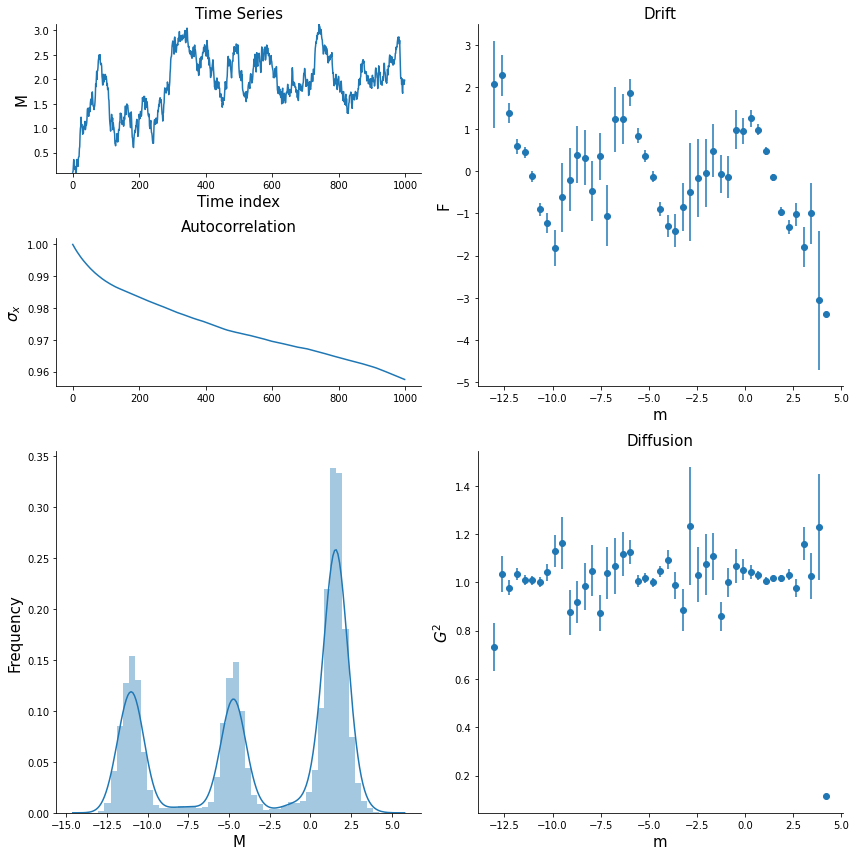

Fitting non-polynomial functions
================================

(Note: This notebook uses the package ``sdeint``, which can be installed
using ``pip install sdeint``.)

By default, ``pydaddy`` fits polynomial functions for drift and
diffusions. However, if the expected functional form is not a
polynomial, ``pydaddy`` provides the option to fit using a custom
library of candidate functions.

.. code:: ipython3

    import pydaddy
    import sdeint
    import numpy as np

Let us generate some simulated time-series data with specified drift and
diffusion, and try to recover the drift and diffusion back from the
time-series. The functions we use are just for demonstration, and may
not have any ecological or physical significance.

.. code:: ipython3

    def f(x, t): return np.cos(x) + 0.5 * np.sin(2 * x)
    def g(x, t): return 1
    
    # Simulate and plot data
    t_inc = 0.01
    timepoints = 1e5
    tspan = np.arange(0, t_inc * timepoints, step=t_inc)
    data = sdeint.itoint(f=f, G=g, y0=0.1, tspan=tspan)

.. code:: ipython3

    ddsde = pydaddy.Characterize([data], tspan)

.. parsed-literal::

    | M range              : (-13.025, 4.211)|
    | M mean               :     -3.032     |
    | |M| range            :  (0.0, 13.025) |
    | |M| mean             :      4.598     |
    | Autocorr time (M)    :       750      |
    | (Dt, dt)             :     (1, 1)     |
    

The custom library can be defined as a list of functions, as follows. In
this case, our library consists of sinusoids of 3 different frequencies,
and the constant function. The functions you choose to include in the
library will depend on the specific problem.

.. code:: ipython3

    library = [
            lambda x: np.ones_like(x),  # Each function in the library, when called with an np.array, should return an array of the same shape.
            lambda x: np.sin(x),
            lambda x: np.cos(x),
            lambda x: np.sin(2 * x),
            lambda x: np.cos(2 * x),
            lambda x: np.sin(3 * x),
            lambda x: np.cos(3 * x),
        ]

While calling ``ddsde.fit``, the library can now be passed as a
parameter. The output will now just be a list of coefficients,
corresponding to each function in the library. Two arrays are returned,
corresponding to the coefficient values and their standard errors
respectively.

.. code:: ipython3

    F = ddsde.fit('F', library=library, tune=False, threshold=0.2)
    F

.. parsed-literal::

    (array([0.        , 0.        , 1.09839997, 0.40509491, 0.        ,
            0.        , 0.        ]),
     array([0.07999477, 0.11491849, 0.11033383, 0.11359374, 0.10724106,
            0.07760818, 0.07605634]))

Here, the second and third coefficients, corresponding to the
:math:`\cos x` and :math:`\sin 2x` terms of the library, are non-zero:
this matches with our original model.

.. code:: ipython3

    G = ddsde.fit('G', library=library, tune=False, threshold=0.2)
    G

.. parsed-literal::

    (array([1.01833919, 0.        , 0.        , 0.        , 0.        ,
            0.        , 0.        ]),
     array([0.0114258 , 0.01641402, 0.01575919, 0.01622481, 0.01531744,
            0.01108492, 0.01086327]))

*Note:* Although in this case we used the same library for both drift
and diffusion, this need not be the case in general: if required, we can
use different libraries while fitting different functions.

